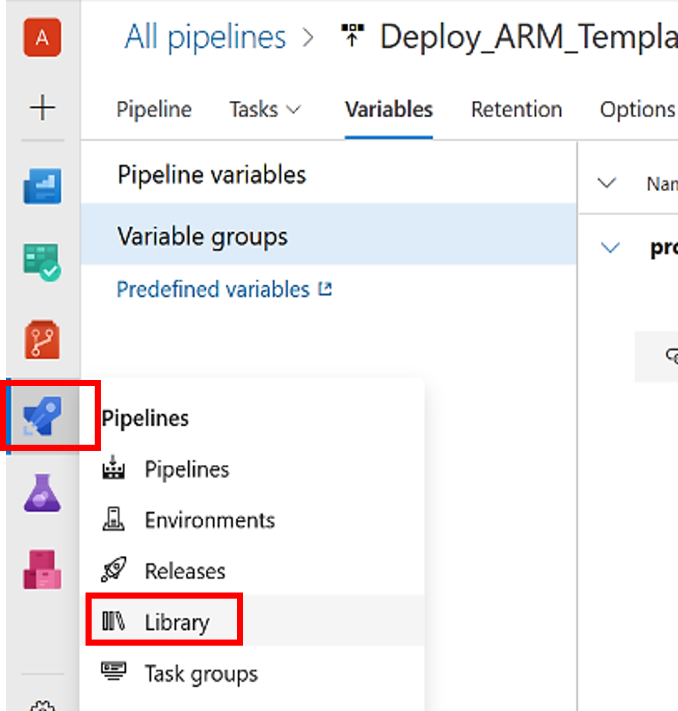
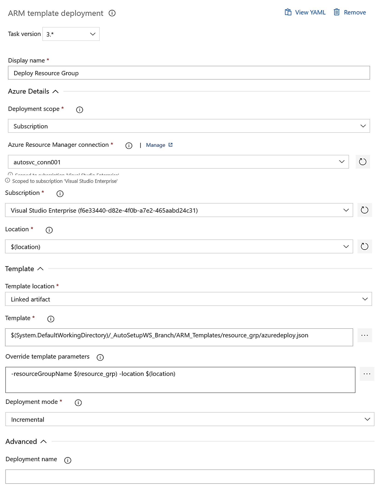
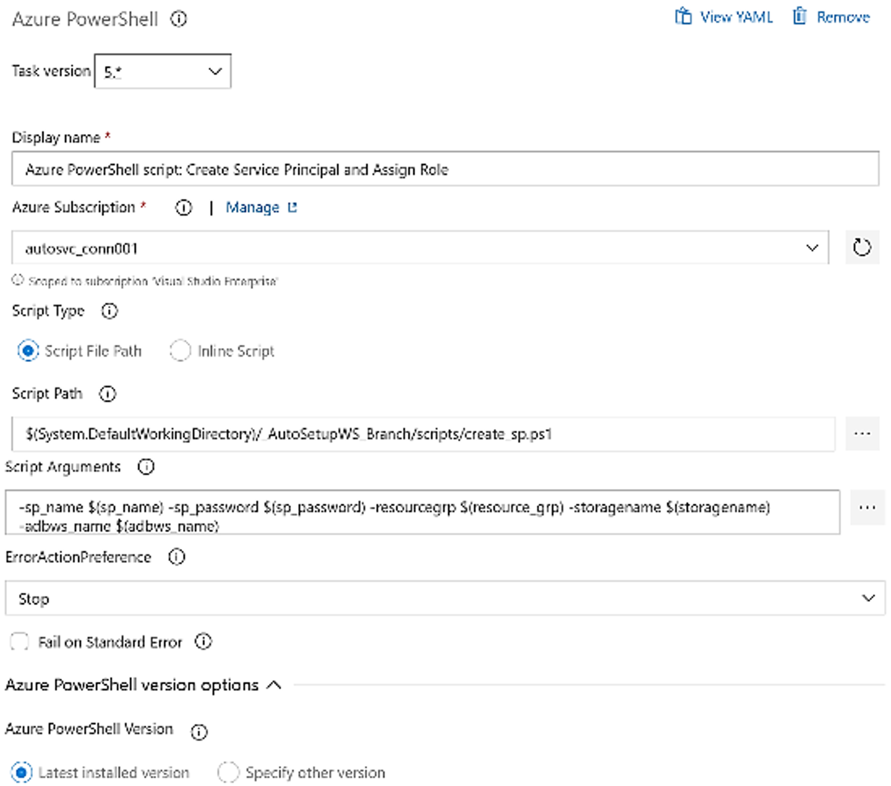
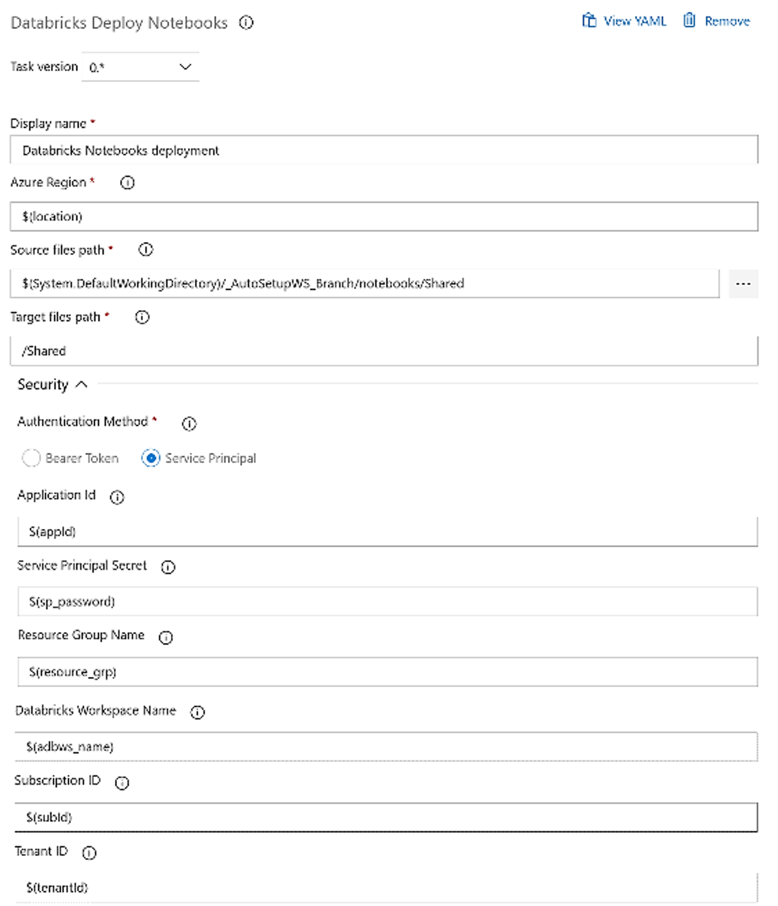
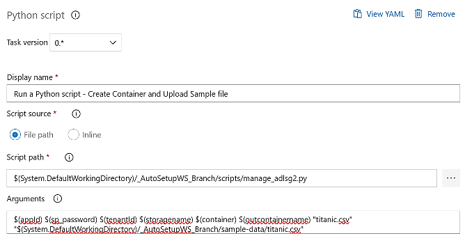

This repository is to help users who are** new to Azure DevOps** and want to create a E2e Release Pipeline. 
## What Artifacts It Creates? ##
Repository contains Sample Pipeline template that performs following activities - 
1. Create Azure Components e.g. Azure Resource Group, Azure Data Factory, Azure Storage, Data Bricks
2. Create Service Principal and assing specific roles based on the component i.e. "Storage Data Contributor" role for Azure Storage, "Contributor" role for Azure DataBricks Workspace 
3. Creates containers in Azure Storage and uploads sample data file
4. Deploy Notebook code from your git repository to the newly created Azure DataBricks worksapce
5. Creates Databricks Cluster usign the predefined configuration
6. Creates Setup job that mounts the Azure Storage container created in #3 and executes it 

## Prerequisites ##
1. Azure Subscription refer [_this_](https://azure.microsoft.com/en-in/free/) link for creating Free Azure account
2. Azure DevOps Account -  please check [_this_](https://docs.microsoft.com/en-us/azure/devops/user-guide/sign-up-invite-teammates?view=azure-devops)
3. Service connection for DevOps - This is a service principal that has contributor access to your Azure subscription refer [_this_](https://docs.microsoft.com/en-us/azure/devops/pipelines/library/service-endpoints?view=azure-devops&tabs=yaml) link
4. Knowledge of Azure and Azure DevOps is advantageous 

## How to Start ##
Please refer the below pipeline image. There are 3 Types of Tasks need to be created
1. ARM Deployment Task
2. Azure Powershell Task
3. Databricks Task
4. Python Task

Before you start please create a Release Pipeline setting following paraeters as pipleine variables
* adbInstanceURL = <VALUE KEEP EMPTY>
* appId = <VALUE KEEP EMPTY>
* deploy_sp = false
* deploy_ws = true
* tenantId = <VALUE KEEP EMPTY>

Create Release Scope variables using library as showj below


Create a variable group as prod & Add following parameters - 
* adbws_name = adbautows$(env)21
* datafactoryname = adfautows$(env)21
* container = input
* outcontainername = output
* env = prod
* location = southeastasia
* mount = "/mnt/adbauto"
* resource_grp = rg_autows-$(env)21
* sp_name = spautoadbws$(env)21
* sp_password = <USE_STRONG_PASSWORD>
* storagename = autowsstr$(env)21
* subId = <ID OF YOUR SUBSCRIPTION>

<b> ARM Deployment Task </b>
1. Create 3 ARM Template deployment task refer [this](https://github.com/microsoft/azure-pipelines-tasks/blob/master/Tasks/AzureResourceManagerTemplateDeploymentV3/README.md) link for more details on ARM Template deployment.
2. Create ARM Deployment Task for Resource Group, Storage Account, ADF and Databricks using ARM templates in repository  
3. Provide necessary details on location where component to be deployed, subscription & Service connection
4. Specify Template based on components to be used from github repo
5. Provide parameter overriding as needed and keep the rest of the parameters as default




<b> Azure Powershell Task </b>
1. We will use the powershell task to create the service principals to manage the components created
2. use [this](https://docs.microsoft.com/en-us/azure/devops/pipelines/tasks/deploy/azure-powershell?view=azure-devops) documentation link to create the Task and provide necessary details
3. In Script Path - provide path to "create_sp.ps1" script present in repository
4. copy past following in arguments box and keep the rest of the parameters as default

```

-sp_name $(sp_name) -sp_password $(sp_password) -resourcegrp $(resource_grp) -storagename $(storagename) -adbws_name $(adbws_name)

```
5. After successful creation of the Service Principal powershell script will assign newly created values to appId and tenantId pipeline variables




<b> Databricks Task </b>
1. You need to add this task from Marketplace before using it. Please refer [this](https://marketplace.visualstudio.com/items?itemName=DataThirstLtd.databricksDeployScriptsTasks) link
2. Create a Notebook Task and provide path of notebooks present in source repository
3. Provide Service Principal details created in earlier task by simply specifying the pipeline variables

 

4. Similarly create another databricks task for creating cluster providing necessary parameters. Please make sure to provide the JSON config file present in the repository "databricks_cluster_config/singlenodecluster.json"

<b> Python Task </b></br>
Create 3 Python tasks viz. Use Python version - set to 3, 
Python Script - Install Modules  - configure scripts/install_modules.py to install additinal packages
Python Script - Create Container - configure scripts/manage_adlsg2.py add following as parameters
```
$(appId) $(sp_password) $(tenantId) $(storagename) $(container) $(outcontainername) "titanic.csv" "$(System.DefaultWorkingDirectory)/_AutoSetupWS_Branch/sample-data/titanic.csv"
```
Python script - Create and Execute Databricks Job - configure scripts/create_setupjob.py and add following as parameters
```
$(subId) /Shared/setup/setup $(container) $(storagename) $(appId) $(mount) $(sp_password) $(tenantId) $(adbws_name) $(resource_grp)
```
Following is the screenshot of adlsgen2 pyhon script rest of the scripts can be configured in similar way




## References ##

[DevOps Task Variables](https://docs.microsoft.com/en-us/azure/devops/pipelines/process/variables?view=azure-devops&tabs=yaml%2Cbatch#understand-variable-syntax)

[Task Skipping control conditions](https://docs.microsoft.com/en-us/azure/devops/pipelines/process/conditions?view=azure-devops&tabs=classic)

[Azure Databricks REST API](https://docs.microsoft.com/en-us/azure/databricks/dev-tools/api/latest/)